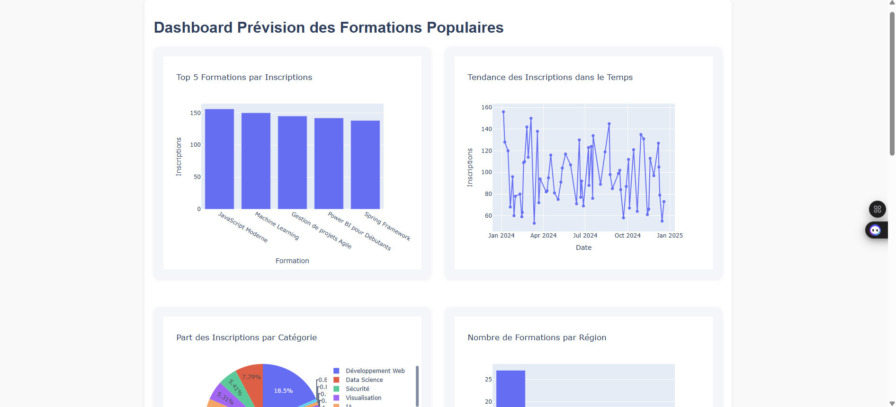

# Prévision des Formations Populaires — Dashboard IA en Temps Réel

**Projet complet de prédiction et d’analyse de la popularité des formations avec dashboard web moderne, pipeline temps réel, et webscraping de données réelles.**

---

## Sommaire
- [Objectif](#objectif)
- [Fonctionnalités](#fonctionnalités)
- [Stack Technique](#stack-technique)
- [Installation](#installation)
- [Utilisation](#utilisation)
- [Structure du Projet](#structure-du-projet)
- [Screenshots](#screenshots)
- [Licence](#licence)

---

## Objectif
Développer une plateforme prédictive et analytique qui :
- Prédit la popularité des formations à partir de données historiques et enrichies en temps réel (webscraping Udemy, Coursera, FreeCodeCamp...)
- Visualise dynamiquement toutes les tendances, catégories, prix, performances formateurs, etc.
- Fournit une interface web moderne, interactive et responsive.

---

## Fonctionnalités
- **Pipeline automatisé** : Nettoyage, enrichissement, modélisation et visualisation à chaque lancement.
- **Web Scraping** : Récupération automatique de nouveaux cours sur Udemy, Coursera et FreeCodeCamp à chaque démarrage.
- **Modèles prédictifs** : Régression linéaire et forêts aléatoires (scikit-learn) sur des features avancés (catégorie, prix, région, etc.).
- **Dashboard interactif** :
  - Top 5 formations
  - Tendances temporelles
  - Répartition des inscriptions par catégorie (pie chart)
  - Répartition régionale
  - Distribution des prix par catégorie (boxplot)
  - Histogramme des notes
  - Corrélation prix/inscriptions (scatter)
  - Taux de participation moyen par formateur
- **UI moderne** : Flexbox responsive, multi-graphes, design épuré.

---

## Stack Technique
| Catégorie        | Outils/Librairies               |
|------------------|---------------------------------|
| Backend API      | FastAPI, Uvicorn                |
| Frontend         | HTML, CSS (Flexbox), Plotly.js  |
| ML/Stats         | scikit-learn, pandas, numpy     |
| Webscraping      | requests, beautifulsoup4         |
| Visualisation    | plotly (Python & JS)            |
| Python           | 3.10+                            |

---

## Installation

1. **Cloner le dépôt**
```bash
git clone https://github.com/FediMechergui/prevision-formation-ia.git
cd prevision-formation-ia
```
2. **Créer un environnement virtuel**
```bash
python -m venv .venv
.venv\Scripts\activate  # (Windows)
```
3. **Installer les dépendances**
```bash
pip install -r requirements.txt
```

---

## Utilisation

1. **Lancer le dashboard (pipeline automatique)**
```bash
uvicorn app:app --reload --host 0.0.0.0 --port 8000
```
2. **Ouvrir le dashboard**

Dans votre navigateur : [http://localhost:8000/](http://localhost:8000/)

- À chaque lancement, le CSV est enrichi de nouveaux cours réels (Udemy, Coursera, FreeCodeCamp), stats et modèles sont recalculés.
- Toutes les visualisations sont interactives et à jour.

---

## Structure du Projet
```bash
.
├── app.py                  # Backend FastAPI (point d'entrée)
├── requirements.txt        # Dépendances
├── data/
│   └── simulated_data.csv  # Données simulées + scrappées
├── src/
│   ├── data_preparation.py # Pipeline de nettoyage
│   ├── model.py            # Modélisation ML
│   ├── visualization.py    # Génération des graphes (Plotly JSON)
│   └── webscraper.py       # Scraping Udemy/Coursera/FreeCodeCamp
├── static/
│   └── index.html          # Dashboard frontend (Plotly.js, Flexbox)
└── README.md
```

---

## Screenshots

> 

---

## Licence

Projet sous licence MIT — libre d’utilisation et modification.
